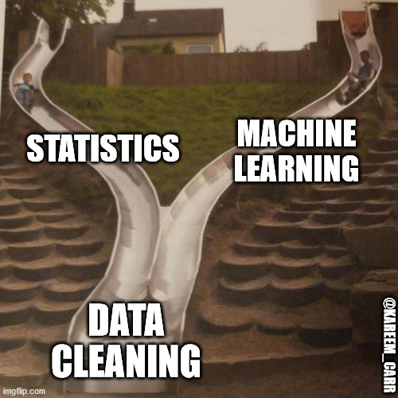

class: title-slide, right, middle
.pull-left[ `r knitr::include_graphics( 'figs/bottom_img.png') `]
<br>
<br>
<br>

# R4Finanace
## Data Mining
### J. Gibrán Peniche
### Versión 0.0.1
### 2020/06/19
####  <i class="fab fa-github"></i> [jgpeniche](https://github.com/jgpeniche)
####  <i class="fab fa-twitter"></i> [PenicheGibran](https://twitter.com/PenicheGibran)
####  <i class="fab fa-google"></i> jgpeniche@gmail.com
---

# Recap

```{r setup, include=FALSE}

options(htmltools.dir.version = FALSE)
diamonds <- data(Diamon)
library(magrittr)
library(ggplot2)
library(dplyr)

```
--

- R y RStudio **NO** son lo mismo

--

- Sintáxis básica

--

  1. `for(i in x){ #DoStuff  }`
  
--

  2. `if( condition ){ #DoStuff }else{ #DoMoreStuff  }`
  
--

  3. `foo <- function( x, y, z, ...){ #DoStuffWithXYZ return(something) }`
  
---

# Recap

- Sintáxis Avanzada

  1. Sustituir `functionA(functionB(functionC(functionD(functionD(object)))))`
  
--

  2. Por 
  
```
library(magritter)

object %>%
  functionA() %>% 
  functionB() %>% 
  functionC() %>% 
  functionD() ...

```
---

# Recap

- Tidy Data:

--

  1. Cada columna es una variable
  
--

  2. Cada renglón es una observación
  
--

  3. Cada tabla es una unidad observacional
---

# Agenda

--

1. ¿Qué es data manipulation?

--

2. Verbos `dplyr`

--

3. Long format

---

class: center, middle
# Antes...

---

# Solución tarea

--


```{r, tarea, verbose = FALSE, message = FALSE}
stocks <- EuStockMarkets %>% 
  as_tibble() %>% 
  janitor::clean_names()

returns <- function(precios, type = c('log','arithmetic')){
  returns <- c()
  returns[1] <- 0
  if(type == 'log'){
      for(i in 2:length(precios))
      returns[i] <- log(precios[i]/precios[i-1])
    }else{
      if(type == 'arithmetic'){
        for(i in 2:length(precios)){ 
        returns[i] <- precios[i]/precios[i-1] - 1
       }
      }else{
       return(print('Not a valid return type'))
      }
    }
  returns %>% 
    as_tibble() %>% 
    return()
}

```

---

# Solución tarea

.pull-left[
```{r tarea2}
stocks %$% 
  returns(precios = dax, type = 'log')
```
]
---

# Solución tarea

.pull-left[ 
```{r tarea3}
stocks %$% 
  returns(precios = dax, type = 'arithmetic')
```
]
---

# Solución tarea


.pull-rigth[ 
```{r tarea4}
stocks %$% 
  returns(precios = dax, type = 'otro')
```
]

---

class: center, middle
# Algo que no hemos explicado

---

# R como proyectoto open-source

--

Como ya mencionamos durante la primera sesión, R es un proyecto **open-source**, entre otras cosas, esto significa que tiene la cualidad de que cualquiera puede **participar**

--

Generalmente la participación se manifiesta en la forma de *issues*, *pull requests* y *librerias*

--

Desde la primera sesión utilizamos la línea `library(#Somelibrary)` pero, ¿Qué es una libreria?

--

Una libreria es un **conjunto** de funciones con un fin específico

--

RStudio por default solo carga cierto número de librerias (por cuestiones de tiempo de inicio), por eso si requerimos funciones con un fin más específico es necesario primero **instalar** la libreria y luego llamarla con `library()` para tener disponibles las funciones

---

# `library(#somelibrary)` vs.  `somelibrary::`

--

El hecho de llamar una biblioteca usando `library()` implica que **todas** las funciones van a a ser llamadas a la memoria. 

--

Esto significa que estas funciones van a ocupar espacio de manera permanente en la memoria

--

Si solo se va a utilizar la función una vez, es buena práctica no llamar toda la libreria a la memoria y utlizar `libreria::función`

--

Esto optimiza el espacio disponible y se vuelve reelavante cuando se trabajan bases de datos grandes o se requiere espacio para procedimientos computacionalmente exhaustivos

---

class: inverse, center, middle
# Data Mining

---

# ¿Qué es Data Mining?

--

```{r fig1, fig.align='center', echo=FALSE, out.width=500, out.height=500}



```

---

# ¿Qué Data Mining?

--

### 1. Es el proceso de **limpieza** de los datos para llevarlos al formato de **TIDY DATA** 

--

### 2. Es la manipulación para obtener resúmenes **minimales**, **suficientes** y en particular desde el punto de vista del **análisis exploratorio de datos**

---

# ¿Cómo se realiza esto en R?

--

En la comunidad de R existen dos librerias para realizar este proceso y una gran [polémica](https://stackoverflow.com/questions/21435339/data-table-vs-dplyr-can-one-do-something-well-the-other-cant-or-does-poorly) sobre cual es mejor 

--

`dplyr` que es cercano a la sintáxis de SQL y `data.table` que es más cercano a la sintáxis de `pandas` en python

--

.pull-left[

**Con data.table**
```
library(data.table)
diamondsDT <- data.table(diamonds)
diamondsDT[
  cut != "Fair", 
  .(AvgPrice = mean(price),
    MedianPrice = as.numeric(median(price)),
    Count = .N
  ), 
  by = cut
][ 
  order(-Count) 
]
```
]

.pull-right[

**Con dplyr**
```
library(dplyr)
diamonds %>%
  filter(cut != "Fair") %>%
  group_by(cut) %>%
  summarize(
    AvgPrice = mean(price),
    MedianPrice = as.numeric(median(price)),
    Count = n()
  ) %>%
  arrange(desc(Count))
```
]

---

# dplyr vs. data.table

### Personalente encuentro `dplyr` mucho más intuitivo, incluso si no estás familiriazdo con el paquete

--

### Además soy fan del *Hadleyverse*

--

### Es la herramienta que vamos a utilizar de aquí en adelante

---

class:inverse, center, middle,
# Los verbos de `dplyr`

---

# Partiendo del objeto *data frame*

--

Todos los verbos en `dplyr` aceptan algo llamado *tidyselect* esto quiere decir que no hace falta llamar el nombre de la solumna usando commillas

--

  1. **select** reduce el objeto a ciertas columnas
  
--

  2. **filter** filtra los datos del *data frame* de acuerdo a cierta condición lógica
  
--

  3. **group_by** realiza un paso intermedio que agrupa las observaciones de acuerdo a cierto valor para después hacer un resúmen

--

  4. **summarise** permite hacer resumenes de las columunas del *data frame**
  
---

# Un ejemplo práctico

--

```{r ej1, message= FALSE, verbose = FALSE}

baby_names <- babynames::babynames %>% 
  as_tibble()

baby_names %>% 
  glimpse()

```


---

# Un ejemplo práctico

```{r ej2}

baby_names %>% 
  select(year,name,n)

```

---

# Un ejemplo práctico

```{r ej3}

baby_names %>% 
  select(-prop)

```

---

# Un ejemplo práctico

```{r ej4}

baby_names %>% 
  filter(sex == 'F')

```

---

# Un ejemplo práctico

```{r ej5}

baby_names %>% 
  filter(sex == 'F' & name == 'Ida')

```

---

# Un ejemplo práctico

```{r ej6}

baby_names %>% 
  group_by(name) %>% 
  summarise(media = mean(n))

```

---

# Un ejemplo práctico

```{r ej7}

baby_names %>% 
  filter(sex == 'F' & name == 'Ida') %>% 
  group_by(year) %>% 
  summarise(media = mean(n))

```
---

# Ahora ustedes

--

1. Asigna la base de datos `ChickWeight` a una variable y transformal a un *data frame* con `as_tibble()` (Recuerda que necesitas llamar *magritter* y *dplyr*)

--

2. Revisa la documentación (`?función/paquete/objeto`) sobre la base de datos 

--

3. Realiza un exploratorio de las variables en tu *df* con `glimpse()` y luego con `summary()`

--

4. *Filtra* por el tiempo mayor a 0, *agrupa* por tipo de  dieta y haz un *resúmen* de la media y desviación estandar del peso

--

5. ¿De acuerdo a tus análisis que dieta parece ser más efetiva en términos de peso promedio del pollo?

```{r timer1, echo=FALSE}

countdown::countdown(minutes = 5L)


```


---

# Solución

```{r ej8}
pollos <- ChickWeight %>% 
  as_tibble() %>% 
  janitor::clean_names()

pollos %>% 
  filter( time > 0) %>% 
  group_by(diet) %>% 
  summarise(mean_weight = mean(weight))
```

---

# Limpieza de Datos

--

**¿Cuál es el problema de estos datos en el contexto de Tidy Data**

--

```{r clean1}
crimes <- USArrests 
crimes$state <- rownames(crimes)
crimes <- crimes %>% 
  as_tibble() %>% 
  janitor::clean_names()

crimes

```

---
# Limpiea de Datos

### Tenemos 3 variables **Estado**, **Crímen** y **Población**

--

### Sin embargo, la estrucutura de los datos no hace sentido con la semántica de los mismos

--

### ¿Cómo corregimos esto?

--

### La mayoría de las veces nos vamos a encontrar este tipo de bases de datos y lo que queremos es pasarlas a formato *long* de tal manera que se vean así:

---

# Limpiea de Datos

```{r echo=FALSE, message=FALSE, verbose = FALSE}
library(tidyr)
crimes %>% 
  pivot_longer(-state, names_to = 'crime', values_to = 'count')

```

---

# Ahora ustedes (2)

--

1. Busquen la documentación de `tidyr::pivot_longer()` y realicen la misma transformación que yo acabo de hacer

--

2. Guarden este nuevo *data frame* como `crimes_long`

--

3. *Agrupen* por **estado** y por **crímen** y hagan un *resúmen* del *número promedio* por crímen

--

4. ¿Qué estado es el más violento en términos de asesinato y robo?

--

```{r timer2, echo=FALSE}

countdown::countdown(minutes = 10L)

```

---

# Solución

```{r sol2, message=FALSE, verbose = FALSE}

library(tidyr)
crimes_long <- crimes %>% 
  pivot_longer(-state, names_to = 'crime', values_to = 'count')

violence <- crimes_long %>% 
  filter(crime %in% c('murder','assault')) %>% 
  group_by(crime, state) %>% 
  summarise(mean_crimes = mean(count))

max_assault <- violence %>% 
  filter(crime  == 'assault' & mean_crimes == max(mean_crimes))

max_murder <- violence %>% 
  filter(crime  == 'murder' & mean_crimes == max(mean_crimes))

```
---

# Solución

```{r sol3}

max_assault


```

---


# Solución

```{r sol4}
max_murder


```

