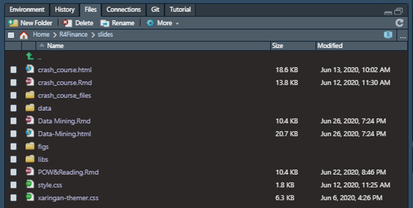
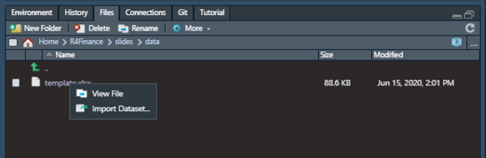
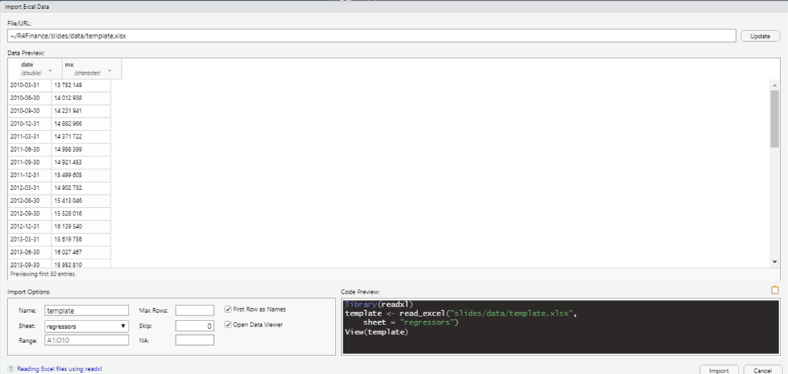

class: title-slide, right, middle
.pull-left[ `r knitr::include_graphics( 'figs/bottom_img.png') `]
<br>
<br>
<br>

# R4Finanace
## Project Oriented Work Flow & Importing
### J. Gibrán Peniche
### Versión 0.0.1
### 2020/06/26
####  <i class="fab fa-github"></i> [jgpeniche](https://github.com/jgpeniche)
####  <i class="fab fa-twitter"></i> [PenicheGibran](https://twitter.com/PenicheGibran)
####  <i class="fab fa-google"></i> jgpeniche@gmail.com
---

# Recap

```{r setup, include=FALSE}

options(htmltools.dir.version = FALSE)
diamonds <- data(Diamon)
library(magrittr)
library(ggplot2)
library(dplyr)
library(readxl)
```
--

- `dplyr`

--

  1. select
  
--

  2. group_by
  
--

  3. filter
  
--

  4. summarise
  
---

# Solución Tarea

--

Sustituir esto

```
crimes <- USArrests
crimes$state <- rownames(crimes)
crimes <- crimes %>% 
  as``_tibble() %>% 
  janitor::clean_names()

```

--

Por esto:

```
crimes <- crimes %>% 
  mutate(state = rownames(crimes)) %>% 
  as_tibble() %>% 
  janitor::clean_names()

```
---

# `dplyr::mutate`

--

### *Crea* ó *Modifica* columnas en el df

---

# Agenda

--

1. Importar datos

--

2. Reproducibilidad

--

3. Software Engineering

--

4. EIKIFJB

--

5. Project Oriented Work flow

---

class: inverse, center, middle
# 1

--

## Importando datos con RStudio

---

# Paso 1

--

<br>

```{r import1, echo=FALSE, fig.align='center', out.width=600, out.height=250}



```
---

# Paso 2

--

<br>

```{r import2, echo=FALSE, fig.align='center', out.width=600, out.height=250}



```
---

# Paso 3

--


```{r import3, echo=FALSE, fig.align='center', out.width=800, out.height=450}



```

---

class: center, inverse
# Algunos problemas...

---

# `setwd` y Paths absolutos

```

setwd('C:/Users/jgpen/Documents/R4Finance/slides')

template <- read_excel("slides/data/template.xlsx", 
    sheet = "regressors")
```

### ¿Alguien ve algún problema?

---

class: center, middle

--

# ¡Obvio! Es que ustedes no tienen el archivo!🤦️

--

## ¿Y ahora que pasó?

---

class: inverse, center, middle
# 2

--

## Reproducibilidad

---

# Reproducibilidad

--

En el mundo de la ciencia de datos, y en particular con la tecnología que tenemos a nuestro alcance, ya no se trata simplemente de hacer *análisis de datos* sino de crear **Productos de Datos**

--

Una de las características de un *producto de datos* es que es **REPRODUCIBLE**

--

En otras paralabras, esto quiere decir que ya no puede  haber *cajas negras* detrás de cualquier tipo de resultado

--

En principio el comando `setwd('Un_path/que_solo/existe/en_mi_computadora')` contraviene específicamente este principio de reproducibilidad

--

### ¿Cómo se resuelve este problema en particular?

---

```{r ds,echo = FALSE, fig.align='center', out.height=600, out.width=600}

knitr::include_graphics('figs/ds_diagram.png')

```

---

class: inverse, center, middle
# 3

--

## Software Engineering

---

class: center, middle
# Hacking Skills = Software Engineering
--

## ¿Do I have to be a Data Engineer to be a Data Scientist?

---

# ¿Do I have to be a Data Engineer to be a Data Scientist?

--

No necesariamente, pero es importante saber 'algo' de lo que ocurre detrás de las herramientas de trabajo que utilizamos

--

[FIKISJB](https://github.com/MonkmanMH/EIKIFJB)

---

class: center, inverse, middle
# 4
--

## Project Oriented Workflow

---

# Project Oriented Workflow

--
### Los desarrolladores de *RStudio* desarrollaron un tipo de archivos cuya extensión es `.Rproj`

--

### Estos archivos fungen como un **punto de partida** para que RStudio sepa en dónde está en **cualquier** computadora

---

# Proyectos Auto-Contenidos

--

De tal suerte de garantizar la *reproducibilidad* de nuestro trabajo debemos seguir el siguiente esquema de trabajo para **CUALQUIER** producto de datos

--

  1. Organizar cada análisis de datos dentro de un proyecto: Un folder que contega todos los archivos necesarios para ese trabajo en particular

--

  2. Cualquier script se debe escribir asumiendo que se va a ejecutar desde el directorio de trabajo que contiene el proyecto. Esto quiere decir que cualquier producto estará también ahí y no tocará nada que no esté en este directorio

--

Esta sencilla convención grantiza que el proyecto puede ir de una lugar a otro y simplemente *va funcionar*

---

class: center, middle
# Intentemoslo de nuevo

---

# POW + `here`

--

### Abrimos R a partir del archivo `.Rproj` o bien seleccionamos el proyecto que queremos de la esquina superior derecha

--

### Importamos la base de datos utilizando la libreria `here`

--

### `here` automaticamente busca la ubicación del proyecto y nos permite accesar a nuestros archivos sin necesidad de usar *paths* tan largos

---

# Ejercicio

--

1. Importar la hoja *is* de la base de datos *template.xlsx* 

--

2. Traspon el estado finaciero utilizando la función `tidyr::pivot_longer` y luego `tidyr::pivot_wider` para poderlo manipular con `dplyr` (HINT: puedes usar `pivot_longer(-concept)` y revisa la documentación de `pivot_wider()`)

--

3. Utilizando `dplyr::mutate` cambiar el tipo de valores de la columna *date* de tipo *character* a tipo *date* (HINT: buscar la documentación sobre el paquete `lubridate` o buscar la manera de hacerlo en StackOverflow)

--

4. Crear una columna llamada *mn* (Margen Neto = utilidad neta/ ventas) utilizando `dplyr::mutate` y posteriormente realizar un resumen del margen **máximo**, el margen **mínimo** y el margen **promedio**

--

5. Pasa la base de datos a formato *tidy* (en este caso *long_format*) utilizando nuevamente `tidyr::pivot_longer`

--

```{r chrono, echo=FALSE}

countdown::countdown(minutes = 15L)

```


---

# Solución

```{r sol1, results='hide', verbose = FALSE, message=FALSE}
library(dplyr)
library(magrittr)
library(readxl)
library(here)
library(tidyr)

is <- here('slides','data','template.xlsx') %>% 
  read_excel(sheet = 'is') %>% 
  pivot_longer(-concept, names_to = 'date' ) %>% 
  pivot_wider(names_from = concept, values_from = value) %>% 
  janitor::clean_names() %>% 
  mutate(date = lubridate::mdy(date),
         nm = net_income/revenue) %>% 
  pivot_longer(-date)

```

